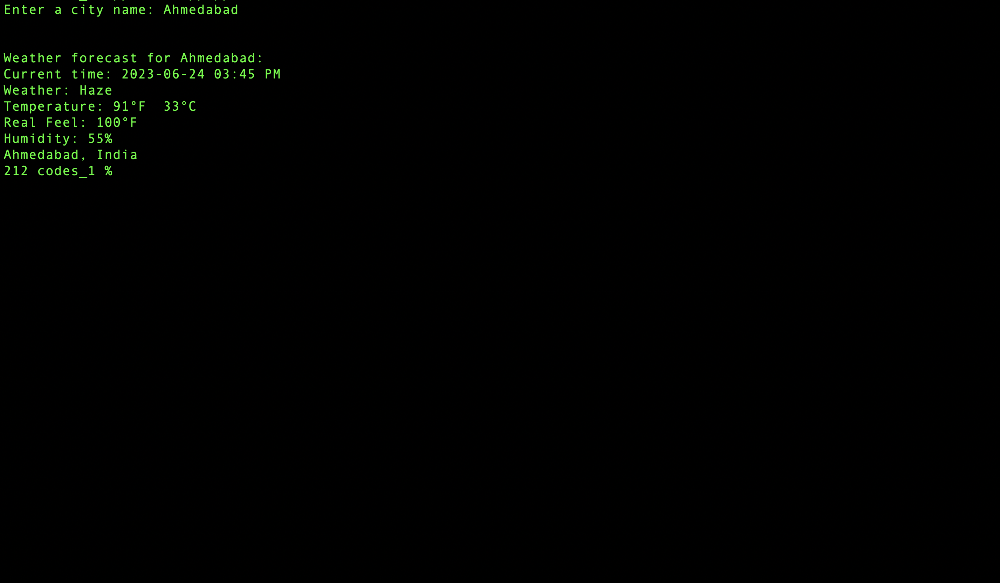

<!-- ABOUT THE PROJECT -->
## About The Project

Weather Forecasting Tool - Create a command line tool that accepts a city's name and returns the current weather forecast. Leverage OpenWeatherMap API to fetch weather data and parse it using Python.


<!-- GETTING STARTED -->
## Getting Started

File 1:- app.py
             This file core command line implementation code.

Output:-



### Before runing map.py thes are the necessary modules should be install first

1. Install Streamlit Folium
```sh
    pip install streamlit_folium
```
2. Install Geopy
```sh
    pip install geopy
```
3. Install Folium
```sh
    pip install folium
```  
   
4. Install Streamlit
```sh
    pip install streamlit
```

File 2:- map.py
             This file contain GUI implementation code.  
    For run map.py file use below:
```sh
    streamlit run map.py
```

Output:-


<!-- CONTACT -->
## Contact

Gmail: vrajpatelxbz@gmail.com
<br>
Project Link: [https://github.com/MaharshPatelX/CareAtHome](https://github.com/MaharshPatelX/CareAtHome)

